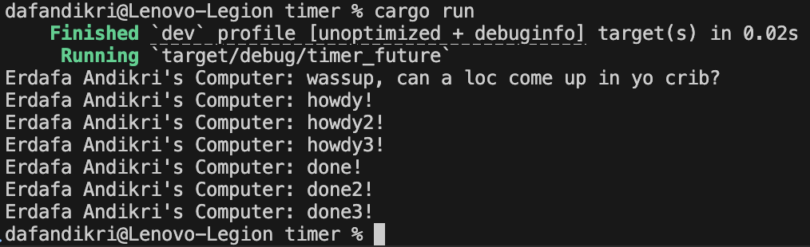
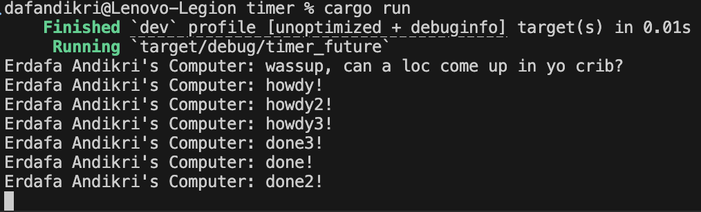

# Module 10 Reflection

## Erdafa Andikri - 2306244993, Class A

### Experiment 1.2: Understanding how it works

**Program Output:**

**Explanation:**

After calling `spawner.spawn(...)`, the spawned async task is only submitted to the spawner's queue, but it does not start executing immediately. The line right after the spawn (the `println!` statement) is executed next, printing "wassup, can a loc come up in yo crib?" to the console. Only when `executor.run()` is called does the executor start polling the queued task, which then prints "howdy!", waits for the timer, and finally prints "done!". This demonstrates that spawning a task does not execute it immediately; the executor must be run to actually execute the spawned tasks.

### 1.3. Multiple Spawn and removing drop

**Screenshots:**

**Explanation:**

- **Effect of Spawning:**  
  Spawning with `spawner.spawn(...)` schedules new asynchronous tasks to be executed by the executor. Each call to `spawn` puts a new task into the queue, but does not execute it immediately.

- **What is the Spawner for?**  
  The spawner is responsible for submitting new tasks to the executor's queue. It acts as the interface for adding work to be done.

- **What is the Executor for?**  
  The executor is responsible for running the tasks that have been submitted by the spawner. It pulls tasks from the queue and polls them until they are complete.

- **What is the Drop for?**  
  Calling `drop(spawner)` signals to the executor that no more tasks will be submitted. This allows the executor to exit its run loop once all queued tasks are finished. If `drop(spawner)` is omitted, the executor will wait indefinitely for more tasks, and the program will not terminate.

- **Correlation:**  
  The spawner and executor work together: the spawner submits tasks, and the executor runs them. The `drop(spawner)` call is crucial for graceful shutdown. Without it, the executor cannot know when all tasks have been submitted, so it waits forever. With it, the executor knows when to stop after all tasks are done.

- **Observed Behavior:**
  - With `drop(spawner)`, the program prints all "howdyX!" and "doneX!" messages and then exits as expected.
  - Without `drop(spawner)`, the program prints the same messages, but then hangs and does not terminate, because the executor is still waiting for possible new tasks.

This experiment demonstrates the importance of properly signaling task submission completion in async executors.
