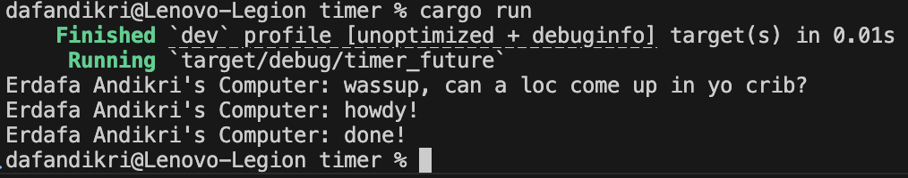

# Module 10 Reflection

## Erdafa Andikri - 2306244993, Class A

### Experiment 1.2: Understanding how it works

**Program Output:**

**Explanation:**

After calling `spawner.spawn(...)`, the spawned async task is only submitted to the spawner's queue, but it does not start executing immediately. The line right after the spawn (the `println!` statement) is executed next, printing "wassup, can a loc come up in yo crib?" to the console. Only when `executor.run()` is called does the executor start polling the queued task, which then prints "howdy!", waits for the timer, and finally prints "done!". This demonstrates that spawning a task does not execute it immediately; the executor must be run to actually execute the spawned tasks.
